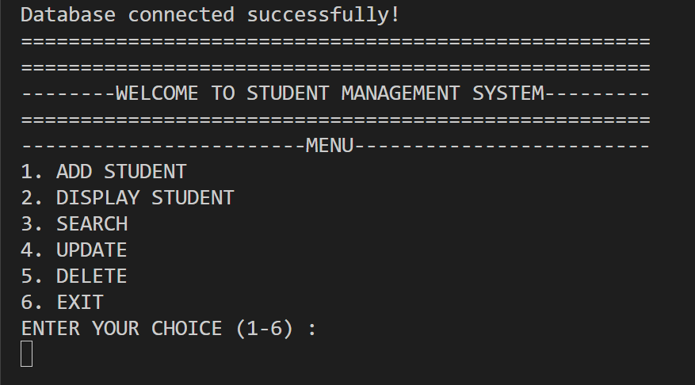
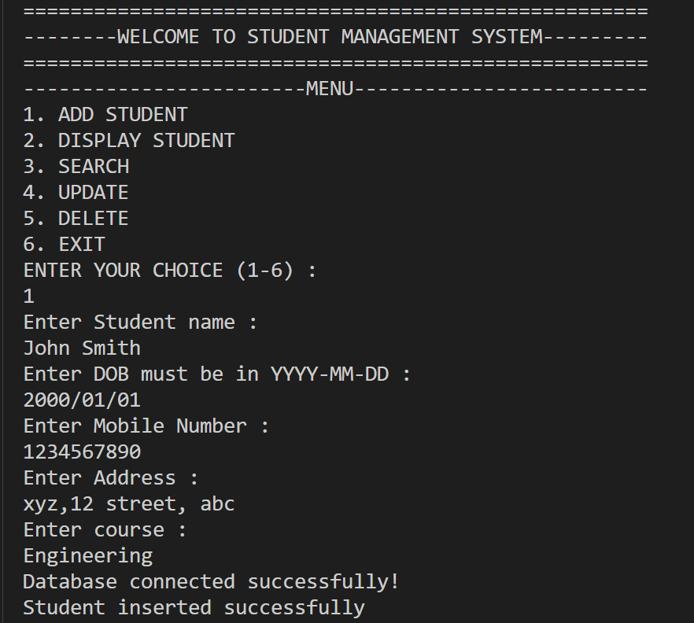
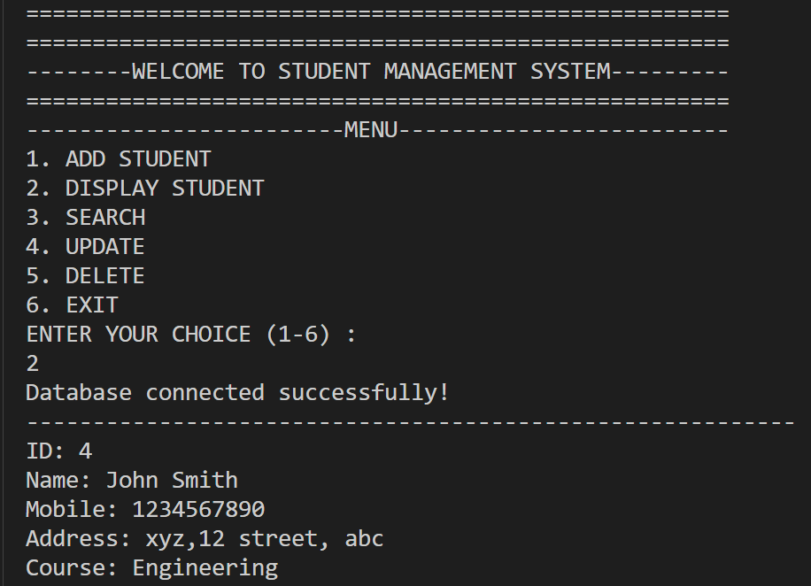
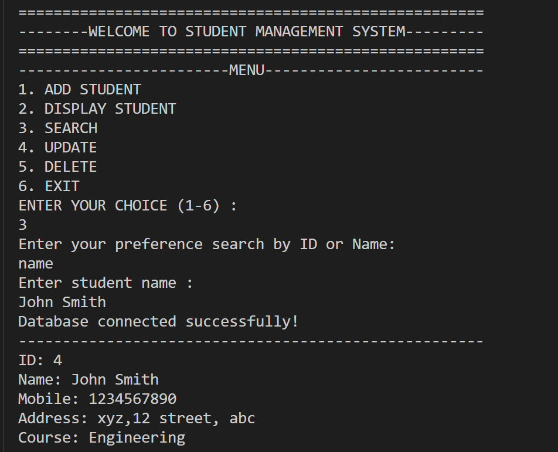
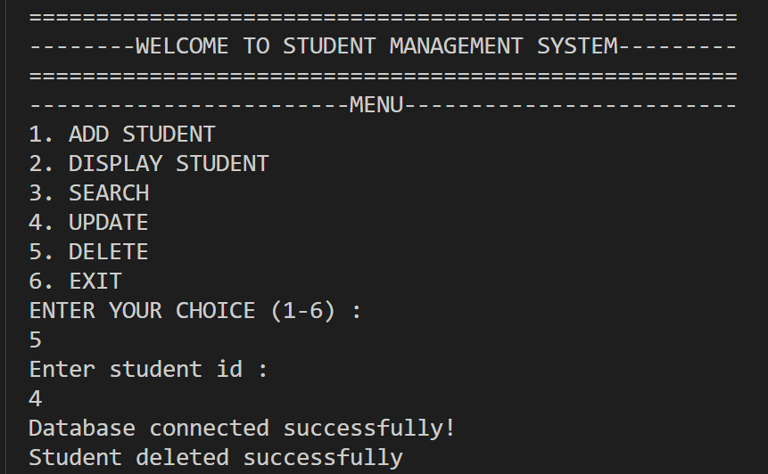
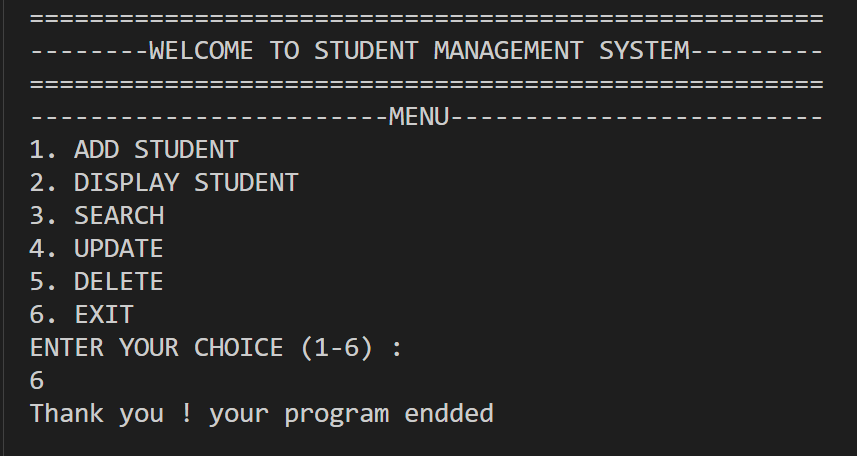

# Student Management System

A console-based Student Management System developed using Java, JDBC, and MySQL. The application allows users to manage student records through a menu-driven interface and stores the data in a MySQL database.

## Features

* **Add Student:** Insert new student records into the database.
* **Display Students:** Retrieve and display saved student records.
* **Search Student:** Search for students by ID or name.
* **Delete Student:** Remove student records from the database.
* **Persistent Storage:** Store student information in MySQL using JDBC.
* **Secure Query Practices:** Use `PreparedStatement` for parameterized SQL queries.
* **Configuration Management:** Load the database password from a local `.env` file.

## Technologies Used

* Java
* JDBC (Java Database Connectivity)
* MySQL
* MySQL Workbench
* dotenv-java
* MySQL Connector/J
* Visual Studio Code

## Project Structure
'''
StudentManagementSystem/
├── src/
│   ├── Main.java
│   ├── Student.java
│   ├── StudentDAO.java
│   └── DBConnection.java
├── lib/
│   ├── mysql-connector-j-9.7.0.jar
│   └── dotenv-java-3.2.0.jar
├── screenshots/
│   ├── menu.png
│   ├── add-student.png
│   ├── display-students.png
│   └── search-student.png
├── database.sql
├── README.md
├── .gitignore
└── .vscode/
    └── settings.json
'''

**Note:** `.env` is a local configuration file and must not be committed to GitHub.

## Database Setup

1. Install MySQL Server and MySQL Workbench.
2. Open MySQL Workbench and connect to your local MySQL server.
3. Open the `database.sql` file from this repository.
4. Execute the SQL script to create the database and student table.
5. Update the database credentials in your local `.env` file.

## Environment Configuration

Create a `.env` file in the project root directory:

```env
DB_PASSWORD=your_mysql_password
```

Replace `your_mysql_password` with your own local MySQL password.

The application uses the database connection configuration in `DBConnection.java` to connect to the `studentdata` database.

Do not upload your `.env` file or database password to GitHub.

## How to Run

### Prerequisites

* Java Development Kit (JDK)
* MySQL Server
* Visual Studio Code or another Java IDE
* MySQL Connector/J and dotenv-java JAR files in the `lib` directory

### Run in Visual Studio Code

1. Clone or download this repository.
2. Open the project folder in VS Code.
3. Configure your local `.env` file.
4. Execute `database.sql` in MySQL Workbench.
5. Ensure the JAR files in `lib/` are configured as referenced libraries.
6. Open `Main.java` and run the program using the Java extension.

## Application Screenshots

Screenshots of the application are available in the `screenshots/` directory.

### Main Menu



### Add Student



### Display Student Records



### Search Student



### Delete Student



### Exit Student



## Learning Outcomes

* Practiced object-oriented programming in Java.
* Learned how to connect Java applications to MySQL using JDBC.
* Implemented database operations using SQL and `PreparedStatement`.
* Organized application logic into separate model, database connection, and data access classes.
* Practiced managing configuration and protecting database credentials.

## Future Improvements

* Implement student record updates.
* Improve input validation and exception handling.
* Add sorting and more advanced search options.
* Develop a graphical interface or REST API.

## Author

Anurag Rathore

[GitHub Profile](https://github.com/APSR07)

